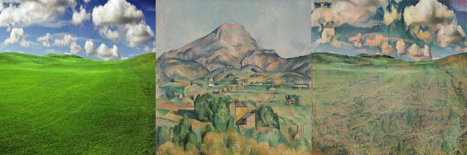
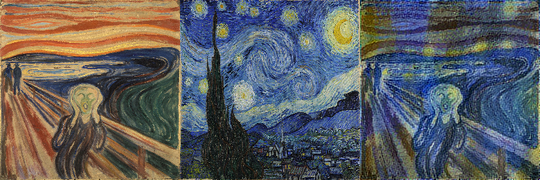
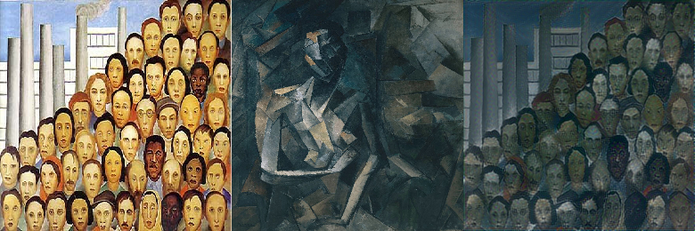

# Transferência de estilo

Transferência de estilo é um processo no qual nos esforçamos para modificar o estilo de uma imagem enquanto preservamos seu conteúdo. Dada uma imagem de entrada e uma imagem de estilo, podemos gerar uma imagem de saída com o conteúdo original, mas com um novo estilo. Um exemplo é este acima.

O processo é descrito no notebook presente neste repositório e também no artigo no Ensina.AI (Medium):

LINK MEDIUM

Também neste repositório há um script para se gerar uma imagem estilizada com facilidade. Para executá-lo basta executar:

python3 Neuron\ Style\ Transfer.py 'entrada' 'estilo'

Sendo 'entrada' o caminho de uma **imagem** para ser estilizada, e 'estilo' deve ser o caminho para a **imagem** de estilo. Um exemplo (que gera a imagem ilustrativa acima) que funciona neste repositório pode ser visto abaixo:

python3 Neuron\ Style\ Transfer.py Imagens/win_xp.jpg Imagens/barnes.jpg

# Outros exemplos de transferência de estilo

